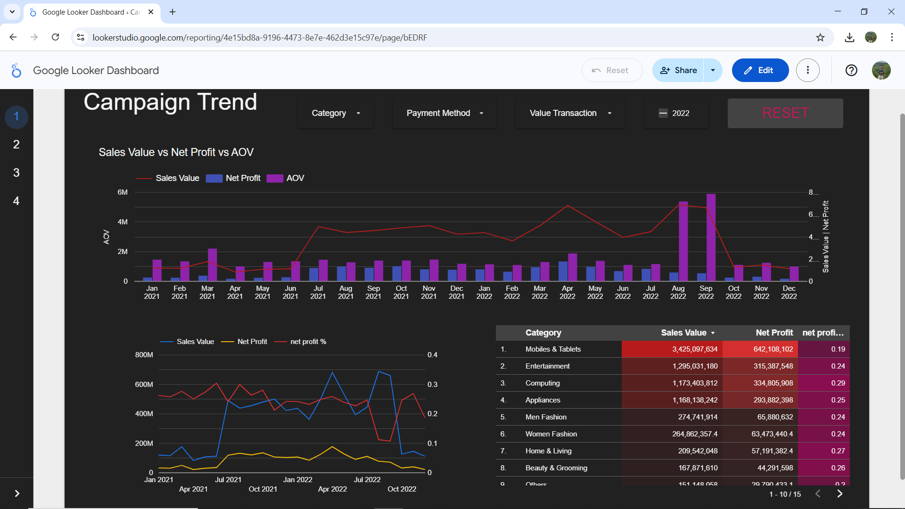
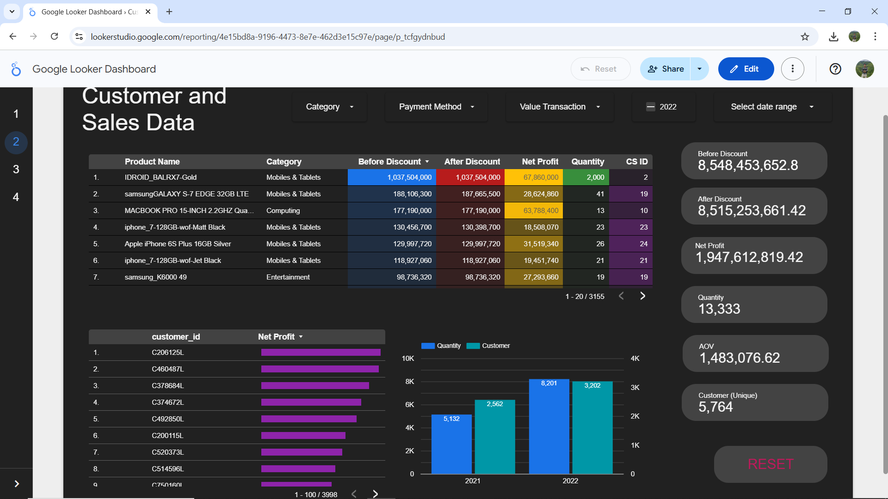
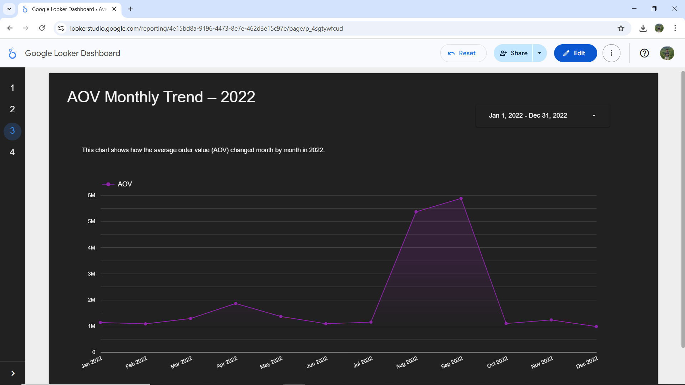
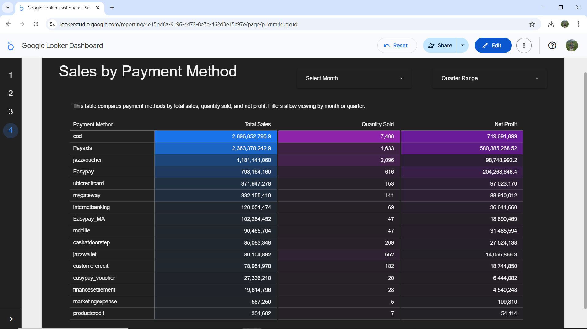

# Google Looker Studio Internship Project – Sales Analytics Dashboard

This repository showcases the final project I completed as part of my internship with **Nullclass**, focused on real-time data analytics using **Google Looker Studio**. 
The goal was to build an interactive, insightful sales dashboard based on provided e-commerce data, applying concepts learned during the training phase.

---

## 🔗 Live Dashboard

📊 [Click here to view the published Looker Studio dashboard](https://lookerstudio.google.com/reporting/4e15bd8a-9196-4473-8e7e-462d3e15c97e)

---

## 📌 Project Objectives

The internship required designing two core dashboards to support business analysis and decision-making:

### 🧩 Task 1: Average Order Value (AOV) Trend – 2022

- **Objective:** Analyze monthly changes in AOV during 2022
- **Calculation:** `SUM(after_discount) / COUNT_DISTINCT(id)`
- **Visualization:** Line chart grouped by month
- **Interactive Filter:** Date range limited to 2022

### 🧩 Task 2: Sales Performance by Payment Method

- **Objective:** Compare different payment methods by total sales, units sold, and profit
- **Metrics Used:**
  - Total Sales → `SUM(before_discount)`
  - Quantity Sold → `SUM(qty_ordered)`
  - Net Profit → `SUM(after_discount - cogs)`
- **Visualization:** Pivot table with heatmap styling
- **Filters Included:** Month selector and custom **quarter grouping**

---

## 🧰 Tools & Technologies

The project involved working across multiple tools, including:

- **SQL Workbench** – for early-stage data querying and inspection
- **Jupyter Notebook** – for dataset exploration and validation
- **Google Looker Studio** – for building final interactive dashboards
- **Microsoft Word / PDF** – for documenting and reporting
- **GitHub** – for organizing and presenting deliverables

---

## 📷 Dashboard Screenshots

### 🔹 Page 1: Campaign Performance Overview  

### 🔹 Page 2: Customer & Sales Summary  

### 🔹 Page 3: AOV Monthly Trend – 2022  

### 🔹 Page 4: Sales & Profit by Payment Method  

## 📁 Repository Contents

| File                              | Description                                           |
|-----------------------------------|-------------------------------------------------------|
| `Google Looker Dashboard.pdf`     | Complete exported dashboard (all 4 pages)            |
| `Page1_Campaign_Overview.png`     | Screenshot – Campaign Performance Overview           |
| `Page2_Customer_Summary.png`      | Screenshot – Customer & Sales Summary                |
| `Page3_AOV_Trend.png`             | Screenshot – AOV Monthly Trend (2022)                |
| `Page4_Payment_Analysis.png`      | Screenshot – Sales & Profit by Payment Method        |
| `Arjit_Internship_Report.pdf`     | Final internship report document                     |
| `README.md`                       | Project summary, task explanation, and dashboard link|

## 👨‍💼 Author

**Arjit Raghuvanshi**  
Final Internship Submission  
[Nullclass – Real-Time Analytics Internship](https://nullclass.com)

---

## ✅ Project Status

🟢 **Completed** — Ready for evaluation and stipend review
